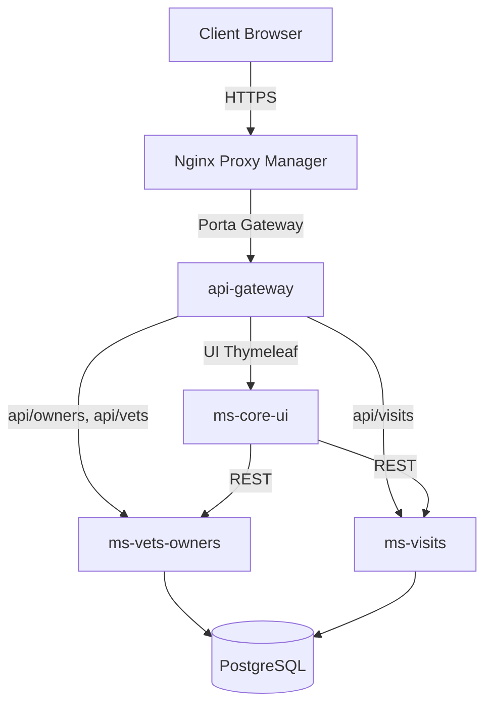
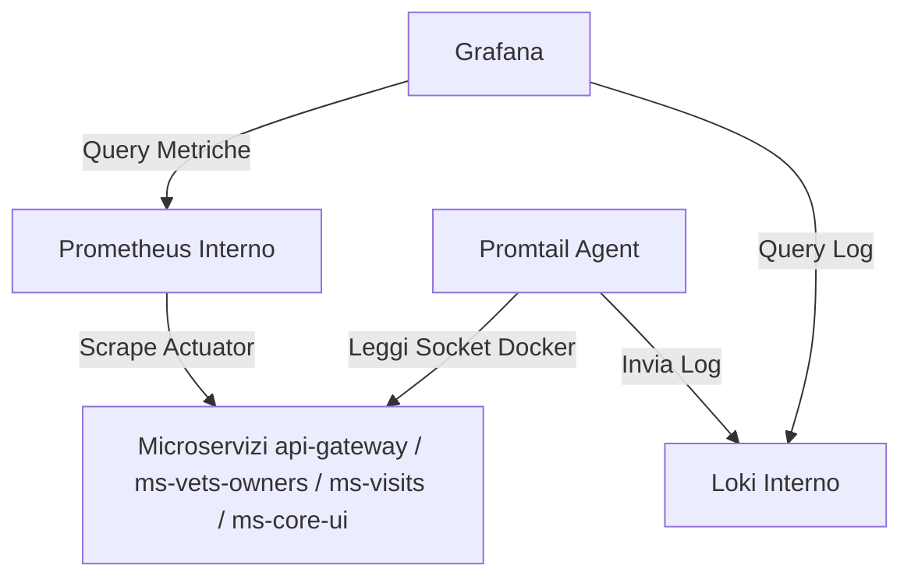

# Spring PetClinic: Microservizi Cloud-Native

> Fork di [spring-projects/spring-petclinic](https://github.com/spring-projects/spring-petclinic). Dimostrazione pratica di migrazione da un monolite a un'architettura cloud-native a microservizi, con CI/CD automatizzato e stack di osservabilità integrato.

[](https://github.com/UmbertoLeone/spring-petclinic/actions/workflows/deploy.yml)

***

## Indice ReadMe

- [1. Visione del Progetto e Metodologia](#1-visione-del-progetto-e-metodologia)
- [2. Governance, Normativa e Sovranità del Dato](#2-governance-normativa-e-sovranità-del-dato)
- [3. Pilastri Tecnici di Sicurezza: Zero Trust Implementation](#3-pilastri-tecnici-di-sicurezza-zero-trust-implementation)
- [4. Matrice di Sicurezza](#4-matrice-di-sicurezza)
- [5. Architettura del Progetto](#5-architettura-del-progetto)
  - [5.1 Componenti Funzionali e Flusso delle Richieste](#51-componenti-funzionali-e-flusso-delle-richieste)
  - [5.2 Decisioni Architetturali](#52-decisioni-architetturali)
  - [5.3 Albero directory del progetto](#53-albero-directory-del-progetto)
  - [5.4 Stack di Osservabilità e Monitoraggio](#54-stack-di-osservabilità-e-monitoraggio)
  - [5.5 Automazione dei Rilasci (CI/CD)](#55-automazione-dei-rilasci-cicd)
- [6. Stack Tecnologico](#6-stack-tecnologico)
  - [6.1 Protocolli Crittografici](#61-protocolli-crittografici)
- [7. Modello Operativo e Ruoli](#7-modello-operativo-e-ruoli)
- [8. Funzionalità Operative del Sistema](#8-funzionalità-operative-del-sistema)
- [9. Test d'Uso (Scenari Legittimi per Ruolo)](#9-test-duso-scenari-legittimi-per-ruolo)
- [10. Test d'Abuso (Security Stress Test)](#10-test-dabuso-security-stress-test)
- [11. Guida all'Installazione e Ambienti](#11-guida-allinstallazione-e-ambienti)
- [12. Risoluzione Problemi (Troubleshooting)](#12-risoluzione-problemi-troubleshooting)
- [13. Riferimenti Normativi e Riferimenti Teorici](#13-riferimenti-normativi-e-riferimenti-teorici)

---

## 1. Visione del Progetto e Metodologia

Il progetto preso in analisi è Spring PetClinic. Originariamente presentava una architettura monolitica. Il prototipo finale dimostra l'efficacia di un'architettura distribuita a microservizi. Ho configurato la distribuzione su due ambienti (Staging, Prod) su una VPS OCI tramite Docker Compose e automatizzato il rilascio con una pipeline di GitHub Actions.

Ho seguito un approccio **Shift Left**, integrando la pipeline di rilascio automatica fin dall'inizio dello sviluppo. L'obiettivo è dimostrare come la scomposizione in moduli indipendenti migliori la tolleranza ai guasti, semplifichi la scalabilità e renda il sistema complessivamente più gestibile ed evolvibile.

---

## 2. Governance, Normativa e Sovranità del Dato

Ho configurato l'infrastruttura per garantire la sovranità assoluta dei dati dell'applicazione. I dati sono accessibili solo tramite le API interne.

---

## 3. Pilastri Tecnici di Sicurezza: Zero Trust Implementation

Nello smontare l'applicazione, ho impostato una rete interna per cui nessun servizio si fida implicitamente degli altri:

*   **Never Trust, Always Verify:** Ho isolato i microservizi di backend (`ms-visits`, `ms-vets-owners`) and il database PostgreSQL. Negli ambienti di staging e produzione **non espongono alcuna porta pubblica** all'esterno del container. L'unico modo per interagirvi è transitare dall'API Gateway.
*   **Micro-Segmentazione:** Ho bloccato tutti i canali d'accesso host-container tranne quelli strettamente necessari. L'api-gateway funge da barriera invalicabile, inoltrando solo le richieste conformi ai percorsi dichiarati.

---

## 4. Matrice di Sicurezza

Ho riassunto le contromisure tecniche che ho implementato a protezione del sistema contro le minacce principali:

| Minaccia / Requisito | Soluzione Implementata nel Progetto |
| :--- | :--- |
| **Bypass del Gateway** | **Porte Chiuse all'Host:** I servizi di backend non mappano porte sull'host (`ports` rimosso in staging/prod). |
| **Intercettazione in transito** | **Certificati SSL automatici:** Nginx Proxy Manager mappa i domini pubblici forzando l'HTTPS . |
| **Data Leakage (Database)** | **Rete Docker Interna:** PostgreSQL (porta 5432) è visibile solo all'interno del bridge Docker. |
| **Port Scanner / Attacchi esterni** | **Reverse Proxy:** Solo il traffico diretto sulle porte dell'API Gateway (8085/8086) viene instradato. |

---

## 5. Architettura del Progetto

L'architettura del sistema è strutturata su un modello a **microservizi containerizzati**, orchestrati per garantire la separazione delle responsabilità e la stabilità operativa.

### 5.1 Componenti Funzionali e Flusso delle Richieste

Ho progettato il punto d'accesso principale attorno a Spring Cloud Gateway. Le richieste degli utenti transitano attraverso questo gateway prima di raggiungere i singoli moduli. Lo schema che segue descrive i dettagli di ogni servizio.



#### Microservizi Configurati

| Servizio | Dettagli di Esecuzione e Responsabilità |
| :- | :- |
| **api-gateway** | Smista il traffico HTTP, gestendo il routing con Spring Cloud Gateway. |
| **ms-vets-owners** | Gestisce i dati di veterinari, proprietari e animali su database PostgreSQL. |
| **ms-visits** | Salva e organizza le visite mediche, appoggiandosi allo stesso database PostgreSQL. |
| **ms-core-ui** | Genera l'interfaccia utente Thymeleaf consumando le API REST esposte dagli altri moduli. |

### 5.2 Decisioni Architetturali

1.  **Disaccoppiamento del Frontend:** Ho spostato il frontend Thymeleaf in un modulo a parte (`ms-core-ui`). In questo modo la logica di presentazione è del tutto slegata da quella dei dati.
2.  **Isolamento Database:** Ho configurato i microservizi per comunicare con l'istanza PostgreSQL unicamente tramite credenziali dedicate e all'interno della rete Docker.
3.  **Gateway Reattivo:** Ho usato Spring Cloud Gateway basato su Spring WebFlux per instradare le richieste in modo asincrono, evitando blocchi di thread durante picchi di traffico.

### 5.3 Albero directory del progetto

Ecco come ho organizzato i file all'interno del progetto:

```
spring-petclinic/
├── api-gateway/               # Spring Cloud Gateway basato su WebFlux
├── ms-vets-owners/            # Microservizio per la gestione di veterinari e proprietari
├── ms-visits/                 # Microservizio dedicato alle visite mediche
├── ms-core-ui/                # Interfaccia utente basata su Thymeleaf
├── src_old/                   # Codice sorgente del monolite originario
├── prometheus/                # Configurazione e Dockerfile di Prometheus
├── grafana/                   # Provvedimenti per datasource e dashboard preconfigurate
├── loki/                      # Configurazione e Dockerfile di Loki
├── promtail/                  # Configurazione e Dockerfile di Promtail
├── docker-compose-staging.yml # Configurazione per l'ambiente di staging locale
├── docker-compose-prod.yml    # Configurazione per l'ambiente di produzione
└── .github/workflows/         # Automazione dei rilasci tramite GitHub Actions
```

### 5.4 Stack di Osservabilità e Monitoraggio

Ho integrato uno stack completo per monitorare le prestazioni del sistema. Prometheus interroga costantemente l'endpoint di raccolta metriche dei microservizi. E Loki riceve i log estratti da Promtail direttamente dai container. E' stato implementato Grafana per riunire queste informazioni in un singolo servizio.



#### Componenti dello Stack

| Componente | Ruolo e Integrazione nel Monitoraggio |
| :- | :- |
| **Prometheus** | Raccoglie metriche JVM e HTTP leggendo i dati dall'endpoint dei servizi. |
| **Grafana** | Mostra le dashboard JVM Micrometer e Loki. |
| **Loki** | Memorizza in modo centralizzato i log di sistema ricevuti in tempo reale dall'agente Promtail. |
| **Promtail** | Legge le righe dal socket di Docker ed effettua lo scraping dei log inviandoli a Loki. |

Ho bloccato l'accesso esterno a Prometheus e Loki. Solo Grafana può comunicare con loro attraverso la rete interna di Docker. Questa scelta protegge i dati sensibili da utenti non autorizzati.

I log vengono filtrati in base all'ambiente grazie alla variabile `PETCLINIC_ENV`. In staging sono visibili solo le attività dei container con prefisso `petclinic-staging-`. In produzione sono controllabili invece quelli con prefisso `petclinic-prod-`.

### 5.5 Automazione dei Rilasci (CI/CD)

La pipeline che ho scritto in `.github/workflows/deploy.yml` si attiva a ogni push. Le immagini vengono depositate su GitHub Container Registry. Ho configurato la build per supportare sia sistemi `linux/amd64` sia `linux/arm64`. Questa scelta è dovuta al fatto che la VPS ospitante è `arm64` e in locale sul mio computer l'architettura è `amd64`.

#### Regole di Rilascio

| Branch Sorgente | Tag Immagine | Target di Rilascio |
| :- | :- | :- |
| `staging` | `:staging` | Stack di staging su Portainer tramite webhook dedicato |
| `main` | `:latest` | Stack di produzione su Portainer tramite webhook dedicato |

#### Immagini Pubblicate su GHCR

| Servizio | Repository GHCR |
| :- | :- |
| Gateway | `ghcr.io/umbertoleone/spring-petclinic-api-gateway` |
| Vets & Owners | `ghcr.io/umbertoleone/spring-petclinic-ms-vets-owners` |
| Visits | `ghcr.io/umbertoleone/spring-petclinic-ms-visits` |
| User Interface | `ghcr.io/umbertoleone/spring-petclinic-ms-core-ui` |
| Prometheus | `ghcr.io/umbertoleone/spring-petclinic-prometheus` |
| Grafana | `ghcr.io/umbertoleone/spring-petclinic-grafana` |
| Loki | `ghcr.io/umbertoleone/spring-petclinic-loki` |
| Promtail | `ghcr.io/umbertoleone/spring-petclinic-promtail` |

---

## 6. Stack Tecnologico

Ho strutturato lo stack tecnologico e le relative porte interne:

| Componente | Tecnologia | Porta Interna | Ruolo |
| :--- | :--- | :--- | :--- |
| **Database** | PostgreSQL 18.4 | `5432` | Persistenza relazionale di proprietari, pet e visite. |
| **Moduli Core** | Spring Boot / Java 21 | `8081` (Vets) / `8082` (Visits) | Microservizi di backend per elaborazione dati. |
| **Frontend UI** | Thymeleaf Web | `8083` | Generazione dell'interfaccia utente. |
| **Gateway** | Spring Cloud Gateway | `8080` | Routing e smistamento unico delle richieste HTTP. |
| **Log Collector** | Loki & Promtail | Interna (Loki) / Socket (Promtail) | Raccolta e aggregazione centralizzata dei log Docker. |
| **Monitoring** | Prometheus & Grafana | `9090` (Prometheus) / `3000` (Grafana) | Estrazione metriche JVM/HTTP e visualizzazione. |

### 6.1 Protocolli Crittografici

*   **HTTPS (TLS 1.3):** Gestito da Nginx Proxy Manager per le chiamate esterne sui domini pubblici.
*   **JDBC con SSL/TLS:** Per la cifratura delle chiamate tra i microservizi e il database PostgreSQL (ove supportato).

---

## 7. Modello Operativo e Ruoli

In linea con il design originale di Spring PetClinic, l'applicazione web non integra un sistema di autenticazione e controllo accessi per gli utenti finali (la UI è ad accesso pubblico aperto). Ho comunque strutturato il modello operativo separando nettamente l'operatività degli utenti ordinari dalla gestione del sistema a livello infrastrutturale:

1.  **Utente Operativo (Pubblico):** Accede liberamente all'interfaccia grafica Thymeleaf (`ms-core-ui`) tramite l'API Gateway per consultare i veterinari, registrare proprietari ed inserire visite. Non ha alcuna possibilità di accedere direttamente ai database o ai sistemi di monitoraggio.
2.  **Amministratore di Sistema:** Si occupa della manutenzione e del controllo dello stato del software. Gestisce i container tramite Portainer (porta `9000`) e analizza la telemetria e i log su Grafana. A differenza della UI pubblica, **queste console amministrative sono protette da credenziali d'accesso dedicate**, isolando le metriche e lo stato del server da utenti esterni.

## 8. Funzionalità Operative del Sistema

Il sistema gestisce le attività quotidiane della clinica veterinaria offrendo all'utente finale un'interfaccia web per eseguire le seguenti operazioni:

### 8.1 Gestione Proprietari (Owners)
*   **Ricerca Proprietari:** Consente di cercare un proprietario inserendo il cognome (ricerca parziale o totale). Se il cognome non viene trovato, l'interfaccia segnala l'assenza; se trova un solo proprietario, reindirizza direttamente al suo profilo; se ne trova multipli, mostra una tabella riassuntiva.
*   **Registrazione Nuovo Proprietario:** Permette di inserire a sistema un nuovo cliente compilando l'anagrafica (Nome, Cognome, Indirizzo, Città e Numero di Telefono).
*   **Modifica Dati Proprietario:** Consente di aggiornare in qualsiasi momento le informazioni di contatto di un proprietario esistente.
*   **Visualizzazione Profilo Completo:** Mostra in un'unica schermata tutti i dettagli del proprietario, l'elenco dei suoi animali domestici registrati e lo storico delle visite di ciascun animale.

### 8.2 Gestione Animali (Pets)
*   **Registrazione Animale:** Consente di associare un nuovo animale a un proprietario specifico, indicandone il Nome, la Data di Nascita e selezionando la Tipologia (es. Cane, Gatto, Lucertola, Uccello, Criceto, Serpente).
*   **Aggiornamento Scheda Animale:** Permette di modificare il nome, la data di nascita o la tipologia di un animale già registrato a sistema.

### 8.3 Gestione Visite (Visits)
*   **Pianificazione Nuova Visita:** Consente di aggiungere un appuntamento/visita medica per un animale, impostando la Data della visita e inserendo una Descrizione dettagliata del motivo della visita (es. "Vaccinazione annuale", "Controllo dentale").
*   **Storico Medico:** Mostra sotto la scheda di ogni animale l'elenco cronologico di tutte le visite effettuate, con la data e la descrizione medica inserita.

### 8.4 Elenco Veterinari (Vets)
*   **Consultazione Staff:** Mostra la lista completa dei veterinari operativi nella clinica.
*   **Visualizzazione Specializzazioni:** Per ogni veterinario presente, l'interfaccia elenca le relative aree di specializzazione clinica (es. radiologia, chirurgia, odontoiatria), facilitando la scelta del medico appropriato.

### 8.5 Strumenti di Amministrazione e Telemetria
*   **Monitoraggio Risorse (Grafana):** Permette all'amministratore di analizzare le prestazioni della JVM, l'uso di memoria, la CPU e i tempi di risposta HTTP dei microservizi.
*   **Analisi Log Centralizzata (Loki):** Consente la consultazione e il filtraggio in tempo reale dei log applicativi di tutti i container Docker da un'unica interfaccia.

---

## 9. Test d'Uso (Scenari Legittimi per Ruolo)

Ho eseguito prove di funzionamento per confermare la correttezza del flusso dei dati.

### 9.1 Scenario 1: Registrazione e Prenotazione Visita
1. Collegarsi all'indirizzo pubblico `https://eds.umbertoleone.it`.
2. Compilare il form per aggiungere un nuovo Proprietario.


3. Aggiungere un nuovo animale


4. Prenotare la visita


### 9.2 Scenario 2: Monitoraggio delle Metriche su Grafana
1. Accedere al pannello Grafana all'indirizzo `https://grafana.eds.umbertoleone.it`.
2. Aprire la Dashboard JVM.
3. Verificare che Prometheus stia effettuando lo scrape in tempo reale.

> <!-- INSERIRE GIF -->

4. Verifica che Loki stia raccogliendo i log.

> <!-- INSERIRE GIF -->

### 9.3 Scenario 3: Validazione Animali Duplicati (Regola di Business)
Ho testato la robustezza del sistema a livello di validazione della business logic provando ad inserire due animali con lo stesso nome per lo stesso proprietario.
1. Accedere al profilo di un proprietario esistente (es. `https://eds.umbertoleone.it/owners/1`).
2. Cliccare su **Add New Pet**.
3. Inserire nel form lo stesso identico nome di un animale già registrato per quel proprietario.
4. Compilare i restanti dati della scheda e tentare l'invio.
5. Verificare che il controller (`PetController`) intercetti il duplicato bloccando l'inserimento in database e restituendo all'utente il messaggio d'errore a schermo: *"is already in use"*.

> <!-- INSERIRE GIF -->

---

## 10. Test d'Abuso (Security Stress Test)

Ho voluto verificare la robustezza della segmentazione di rete simulando tentativi di attacco esterni.

### 10.1 Accesso Diretto ai Microservizi Interni
*   **Scenario di attacco:** Un client malintenzionato tenta di bypassare l'api-gateway inviando chiamate HTTP dirette a `ms-visits` sulla porta `8082` o a `ms-vets-owners` sulla porta `8081`.
*   **Comando eseguito:**
    ```bash
    curl -I http://eds.umbertoleone.it:8082/api/visits
    ```
*   **Risultato:** Connessione rifiutata (Timeout / Porta Chiusa). Essendo le porte non mappate sull'host negli ambienti VPS, l'accesso è fisicamente negato per chiunque sia esterno alla rete Docker.

---

## 11. Guida all'Installazione e Ambienti

Ho esposto gli ambienti configurando un reverse proxy su Nginx con certificati SSL Let's Encrypt.

### 11.1 Mappatura delle Porte negli Ambienti

| Ambiente | Servizio | Porta Esterna | Destinazione Interna | URL Pubblico |
| :--- | :--- | :--- | :--- | :--- |
| **Local Dev** | API Gateway | `8080` | `8080` | `http://localhost:8080` |
| **Local Dev** | Grafana | `3000` | `3000` | `http://localhost:3000` |
| **Staging** | API Gateway | `8086` | `8080` | `https://staging.eds.umbertoleone.it` |
| **Staging** | Grafana | `3001` | `3000` | `https://grafana.staging.eds.umbertoleone.it` |
| **Produzione** | API Gateway | `8085` | `8080` | `https://eds.umbertoleone.it` |
| **Produzione** | Grafana | `3000` | `3000` | `https://grafana.eds.umbertoleone.it` |

### 11.2 Avvio Locale (Development)
Per avviare i servizi in locale con le porte interne esposte per debug:

1. Clonare il repository:
   ```bash
   git clone https://github.com/UmbertoLeone/spring-petclinic.git
   cd spring-petclinic
   ```
2. Avviare lo stack di sviluppo:
   ```bash
   docker-compose up -d
   ```
   *In questo ambiente le porte `8081` (vets-owners), `8082` (visits), `8083` (ui) e `5432` (postgres) sono esposte per permetterti test diretti.*

### 11.3 Avvio in Staging / Produzione (VPS)
I rilasci avvengono automaticamente tramite pipeline GitHub Actions su Portainer (porta `9000`). Per avviare manualmente:
```bash
# Per lo Staging (Porta Gateway 8086, Grafana 3001)
docker-compose -f docker-compose-staging.yml up -d

# Per la Produzione (Porta Gateway 8085, Grafana 3000)
docker-compose -f docker-compose-prod.yml up -d
```

---

## 12. Risoluzione Problemi (Troubleshooting)

Ho creato una tabella per risolvere rapidamente le problematiche di avvio più comuni:

| Sintomo | Causa Probabile | Soluzione Tecnica |
| :--- | :--- | :--- |
| **I microservizi si spengono subito dopo l'avvio** | Il database PostgreSQL non è ancora pronto a ricevere connessioni. | I microservizi dipendono da Postgres. Riavvia il servizio interessato (`docker restart petclinic-ms-visits`) non appena Postgres è healthy. |
| **Grafana non mostra log in tempo reale** | L'agente Promtail non ha i permessi di lettura sul socket di Docker. | Assicurati che l'utente nel file di composizione abbia i permessi di lettura per `/var/run/docker.sock`. |
| **Il webhook di Portainer restituisce 403 o 500** | L'indirizzo IP della pipeline GitHub non è abilitato o il token è scaduto. | Rigenera il webhook su Portainer e aggiorna il Secret corrispondente su GitHub. |

---

## 13. Riferimenti Normativi e Riferimenti Teorici

*   **Spring Cloud Gateway Reference Guide:** Per la gestione dell'instradamento reattivo.
*   **The Twelve-Factor App Principles:** Linee guida seguite durante la scomposizione in microservizi.
*   **NIST SP 800-207 (Zero Trust Architecture):** Modello logico per l'isolamento dei database e dei microservizi core.
