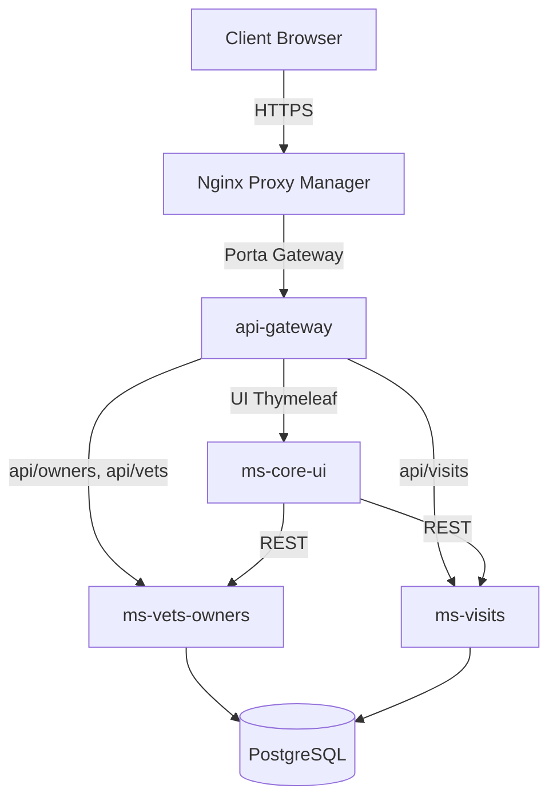
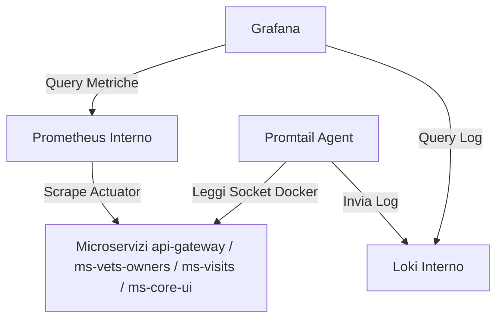

# Spring PetClinic: Microservizi Cloud-Native

> Fork di [spring-projects/spring-petclinic](https://github.com/spring-projects/spring-petclinic). Dimostrazione pratica di migrazione da un monolite a un'architettura cloud-native a microservizi, con CI/CD automatizzato e stack di osservabilità integrato.

[](https://github.com/UmbertoLeone/spring-petclinic/actions/workflows/deploy.yml)

***

## Panoramica

Ho preso il progetto monolite Spring PetClinic e l'ho smontato. Il prototipo finale dimostra l'efficacia di un'architettura distribuita a microservizi. Ho configurato la distribuzione su VPS tramite Docker Compose e automatizzato il rilascio con una pipeline di GitHub Actions.

***

## Architettura e Flusso delle Richieste

Ho progettato il punto d'accesso principale attorno a Spring Cloud Gateway. Le richieste degli utenti transitano attraverso questo gateway prima di raggiungere i singoli moduli. Lo schema che segue descrive i dettagli di ogni servizio.



### Microservizi Configurati

| Servizio | Dettagli di Esecuzione e Responsabilità |
| :- | :- |
| **api-gateway** | Smista il traffico HTTP, gestendo il routing con Spring Cloud Gateway. |
| **ms-vets-owners** | Gestisce i dati di veterinari, proprietari e animali su database PostgreSQL. |
| **ms-visits** | Salva e organizza le visite mediche, appoggiandosi allo stesso database PostgreSQL. |
| **ms-core-ui** | Genera l'interfaccia utente Thymeleaf consumando le API REST esposte dagli altri moduli. |

***

## Osservabilità Sotto Controllo

Ho integrato uno stack completo per monitorare le prestazioni del sistema. Prometheus interroga costantemente l'endpoint di raccolta metriche dei microservizi. E Loki riceve i log estratti da Promtail direttamente dai container. E' stato implementato Grafana per riunire queste informazioni in un singolo servizio.



### Componenti dello Stack

| Componente | Ruolo e Integrazione nel Monitoraggio |
| :- | :- |
| **Prometheus** | Raccoglie metriche JVM e HTTP leggendo i dati dall'endpoint dei servizi. |
| **Grafana** | Mostra le dashboard JVM Micrometer e costituisce l'unico accesso pubblico per analizzare metriche e log. |
| **Loki** | Memorizza in modo centralizzato i log di sistema ricevuti in tempo reale dall'agente Promtail. |
| **Promtail** | Legge le righe dal socket di Docker ed effettua lo scraping dei log inviandoli a Loki. |

Ho bloccato l'accesso esterno a Prometheus e Loki. Solo Grafana può comunicare con loro attraverso la rete interna di Docker. Questa scelta protegge i dati sensibili da utenti non autorizzati.

I log vengono filtrati in base all'ambiente grazie alla variabile `PETCLINIC_ENV`. In staging sono visibili solo le attività dei container con prefisso `petclinic-staging-`. In produzione sono controllabili invece quelli con prefisso `petclinic-prod-`.

***

## Rilascio Continuo con GitHub Actions

La pipeline che ho scritto in `.github/workflows/deploy.yml` si attiva a ogni push. Le immagini vengono depositate su GitHub Container Registry. Ho configurato la build per supportare sia sistemi `linux/amd64` sia `linux/arm64`. Questa scelta è dovuta al fatto che la VPS ospitatnte è `arm64` e in locale sul mio computer l'archiettatura è `amd64`.  

### Regole di Rilascio

| Branch Sorgente | Tag Immagine | Target di Rilascio |
| :- | :- | :- |
| `staging` | `:staging` | Stack di staging su Portainer tramite webhook dedicato |
| `main` | `:latest` | Stack di produzione su Portainer tramite webhook dedicato |

### Immagini Pubblicate su GHCR

| Servizio | Repository GHCR |
| :- | :- |
| Gateway | `ghcr.io/umbertoleone/spring-petclinic-api-gateway` |
| Vets & Owners | `ghcr.io/umbertoleone/spring-petclinic-ms-vets-owners` |
| Visits | `ghcr.io/umbertoleone/spring-petclinic-ms-visits` |
| User Interface | `ghcr.io/umbertoleone/spring-petclinic-ms-core-ui` |
| Prometheus | `ghcr.io/umbertoleone/spring-petclinic-prometheus` |
| Grafana | `ghcr.io/umbertoleone/spring-petclinic-grafana` |
| Loki | `ghcr.io/umbertoleone/spring-petclinic-loki` |
| Promtail | `ghcr.io/umbertoleone/spring-petclinic-promtail` |

***

## Gli Ambienti di Lavoro e Rotte Nginx

Ho esposto gli ambienti configurando un reverse proxy su Nginx con certificati SSL Let's Encrypt.

### Configurazione Ambiente di Staging

| Servizio | URL Pubblico (HTTPS) | Destinazione Interna / Status |
| :- | :- | :- |
| **Applicazione** | [staging.eds.umbertoleone.it](https://staging.eds.umbertoleone.it) | Gateway Staging (Online) |
| **Grafana** | [grafana.staging.eds.umbertoleone.it](https://grafana.staging.eds.umbertoleone.it) | Grafana Staging (Online) |
| **Prometheus** | *Accesso Pubblico Disabilitato* | Prometheus Staging (Solo interno) |

### Configurazione Ambiente di Produzione

| Servizio | URL Pubblico (HTTPS) | Destinazione Interna / Status |
| :- | :- | :- |
| **Applicazione** | [eds.umbertoleone.it](https://eds.umbertoleone.it) | Gateway Produzione (Online) |
| **Grafana** | [grafana.eds.umbertoleone.it](https://grafana.eds.umbertoleone.it) | Grafana Produzione (Online) |
| **Prometheus** | *Accesso Pubblico Disabilitato* | Prometheus Produzione (Solo interno) |

## Struttura del Repository

Ecco come ho organizzato i file all'interno del progetto.

```
spring-petclinic/
├── api-gateway/               # Spring Cloud Gateway basato su WebFlux
├── ms-vets-owners/            # Microservizio per la gestione di veterinari e proprietari
├── ms-visits/                 # Microservizio dedicato alle visite mediche
├── ms-core-ui/                # Interfaccia utente basata su Thymeleaf
├── src_old/                   # Codice sorgente del monolite originario
├── prometheus/                # Configurazione e Dockerfile di Prometheus
├── grafana/                   # Provvedimenti per datasource e dashboard preconfigurate
├── loki/                      # Configurazione e Dockerfile di Loki
├── promtail/                  # Configurazione e Dockerfile di Promtail
├── docker-compose-staging.yml # Configurazione per l'ambiente di staging locale
├── docker-compose-prod.yml    # Configurazione per l'ambiente di produzione
└── .github/workflows/         # Automazione dei rilasci tramite GitHub Actions
```

***

## Lo Stack Tecnologico
| Tecnologia | Dettagli e Ruolo nel Progetto |
| :- | :- |
| **Java & Spring Boot** | Sviluppo dei moduli applicativi utilizzando Spring Boot e Spring Cloud. |
| **Spring Cloud Gateway** | Instradamento reattivo per smistare il traffico ed eseguire il bilanciamento del carico. |
| **PostgreSQL** | Database relazionale condiviso per mantenere persistenti i dati dei microservizi. |
| **Docker & Docker Compose** | Creazione dei container e orchestrazione dei diversi stack locali e remoti. |
| **GitHub Actions & GHCR** | Automazione completa dei test, build multi-architettura e hosting sicuro delle immagini. |
| **Portainer & Nginx** | Amministrazione dei container sulla VPS e gestione centralizzata dei proxy SSL. |
| **Prometheus & Grafana** | Estrazione automatica delle metriche JVM/HTTP e visualizzazione dei dati storici. |
| **Loki & Promtail** | Scansione in tempo reale dei log tramite socket Docker e loro archiviazione. |

***

